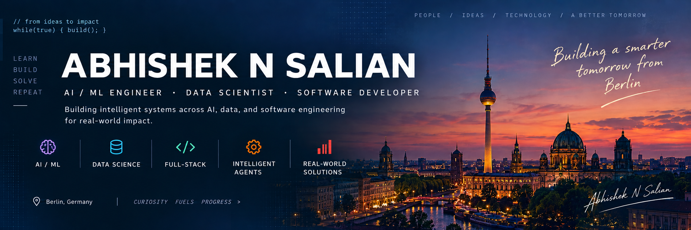

<div align="center">



</div>

<table>
<tr>
<td width="68%" valign="top">

## 👤 About Me

I'm a **Data Science student and developer** passionate about building practical AI and software systems that solve real-world problems.

My work spans **Machine Learning, Deep Learning, Generative AI, Computer Vision, Data Science, Data Engineering, and full-stack development.**

I enjoy taking projects from **idea → experimentation → implementation → deployment**, with a focus on impact, scalability, and usability.

Currently, I'm exploring **AI-powered applications, intelligent agents, RAG systems, and production-oriented ML backends.**

</td>

<td width="32%" valign="middle">

> ### “
>
> Technology is most powerful when it solves real problems and creates opportunities for people.
>
> **— Abhishek Salian**

</td>
</tr>
</table>

---

## ⚙️ Tech Stack

<table>
<tr>
<td><b>Languages</b></td>
<td align="center">🐍 Python</td>
<td align="center">🗃️ SQL</td>
<td align="center">🟨 JavaScript</td>
<td align="center">🔷 TypeScript</td>
<td align="center">☕ Java</td>
<td align="center">C/C++</td>
<td align="center">HTML</td>
<td align="center">CSS</td>
</tr>

<tr>
<td><b>AI / ML</b></td>
<td align="center">🔥 PyTorch</td>
<td align="center">🔶 TensorFlow</td>
<td align="center">🤗 Scikit-learn</td>
<td align="center">🦜 LangChain</td>
<td align="center">🔗 LangGraph</td>
<td align="center">◎ OpenAI</td>
<td align="center">🤗 Hugging Face</td>
<td align="center">👁️ Computer Vision</td>
</tr>

<tr>
<td><b>Data & DB</b></td>
<td align="center">🐘 PostgreSQL</td>
<td align="center">🍃 MongoDB</td>
<td align="center">🔴 Redis</td>
<td align="center">🐬 MySQL</td>
<td align="center">🐼 Pandas</td>
<td align="center">🔢 NumPy</td>
<td align="center">▥ Databricks</td>
</tr>

<tr>
<td><b>Tools & DevOps</b></td>
<td align="center">🔀 Git</td>
<td align="center">◉ GitHub</td>
<td align="center">🐳 Docker</td>
<td align="center">☁️ AWS</td>
<td align="center">🐧 Linux</td>
<td align="center">VS Code</td>
<td align="center">📮 Postman</td>
<td align="center">📺 Streamlit</td>
</tr>
</table>

---

## ⭐ Featured Projects

<table>
<tr>

<td width="33%" valign="top">

### 🛡️ [cyber-ai-platform](https://github.com/abhisheknsalian/cyber-ai-platform)

Multi-agent AI platform for cybersecurity threat analysis with intelligent workflows and threat intelligence processing.

**Tech**

`Python` `AI Agents` `Cybersecurity`

</td>

<td width="33%" valign="top">

### 🗄️ [sqlgpt](https://github.com/abhisheknsalian/sqlgpt)

Natural-language interface for working with SQL databases using LLMs, with a secure and scalable backend.

**Tech**

`Python` `LLM` `FastAPI`

</td>

<td width="33%" valign="top">

### 🔐 [function-level-vulnerability-detection](https://github.com/abhisheknsalian/function-level-vulnerability-detection)

AI-powered system for detecting vulnerabilities at the **function level in source code**, combining machine learning with code analysis.

**Tech**

`Python` `Code Analysis` `Security`

</td>

</tr>
</table>

---

## 📊 GitHub Activity

<table>
<tr>

<td width="33%" align="center">

### 📁 Projects

**18+**

Public Repositories

<a href="https://github.com/abhisheknsalian?tab=repositories">
View Repositories →
</a>

</td>

<td width="33%" align="center">

### 💻 Contributions

**200+**

Contributions this year

<a href="https://github.com/abhisheknsalian">
View Activity →
</a>

</td>

<td width="33%" align="center">

### 🚀 Building

**AI × Data × Software**

Real-world systems

<a href="https://github.com/abhisheknsalian">
Explore Projects →
</a>

</td>

</tr>
</table>

---

## 🚀 What I Care About

```text
Building useful AI
        ↓
Connecting models with real data
        ↓
Designing reliable software systems
        ↓
Deploying solutions people can actually use
